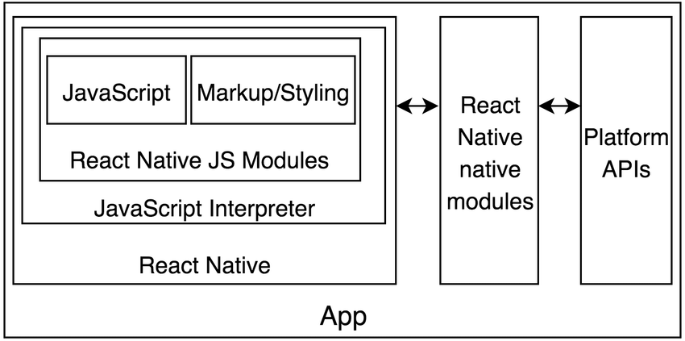
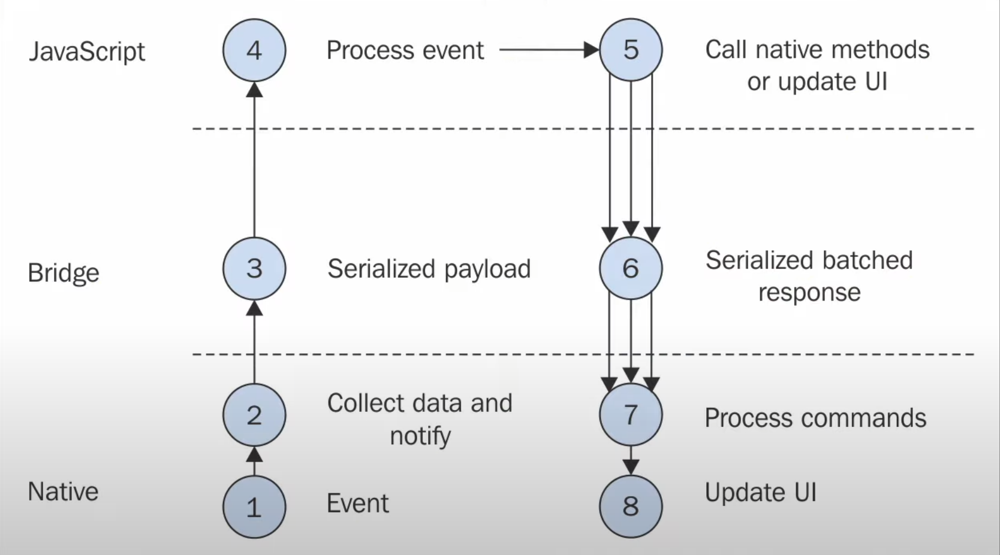

# React Native로 날씨 앱 만들기

## React Native

### 특징

- React Native에서 가장 중요한 부분은 Bridge를 통해 코드가 운영체제와 통신을 할 수 있도록 하는 인프라 시설이다.


 


- 코드 작성 -> 컴파일 -> apk or ipk가 됨 (인프라시설을 포함해서). Java와 xcode가 필요한 이유 -> store 등록
- 즉, React Native 앱은 위 그림의 모든 구조와 Java-script의 조합이다.
- Q. Bridge 때문에 성능상의 이슈가 있을 때가 있을까요? 그 성능 이슈가 어느정도 개발에 영향 갈 정도인지 알 수 있을까요?
  A. UI 애니메이션을 할 때 애니메이션이 유동적으로 보여야 하기 때문에 성능 문제가 대부분 발생하지만 다행히 JS 측에서 만든 애니메이션이 아니라 네이티브 측에서 만든 애니메이션을 사용할 수 있습니다.
- Component : 화면에 표시할 항목.
- Native는 웹이 아니다. 따라서 HTML (예: div)을 사용할 수 없다.
- 가능한 사용자에게 가능한 많은 component와 API를 제공하려 했다. 그러나 빠른 업데이트와 함께 많은 기능을 제공하기는 힘들었다. 빠른 업데이트를 위해 최근에는 지원하는 기능을 줄이고 있는 추세다.
- 지원을 중단한 기능들은 3rd-party, 커뮤니티 패키지를 통해 사용할 수 있다.


### 문법

- div대신 View를 사용할 수 있다. View == container.

- 모든 텍스트는 \<Text> component 안에 작성해야 한다.

- styles를 사용하기 위해서는

  1. StyleSheet 사용

     ```react
     import { StatusBar } from 'expo-status-bar';
     import { StyleSheet, Text, View } from 'react-native';
     
     export default function App() {
       return (
         <View style={styles.container}>
           <Text style={styles.text}>Open up App.js</Text>
           <Text>oh sorry, are you ok?</Text>
           <StatusBar style="auto" />
         </View>
       );
     }
     
     
     const styles = StyleSheet.create({
         container : {
             flex : 1,
             backgroundColor : "#fff",
             alignItems : "center",
             justifyContent : "center",
         },
         text : {
             fontSize : 48,
         }
     });
     ```

     

  2. Object 생성

     ```react
      import { StatusBar } from 'expo-status-bar';
      import { StyleSheet, Text, View } from 'react-native';
      
      export default function App() {
        return (
          <View
              style={{
                flex : 1,
              backgroundColor : "#fff",
              alignItems : "center",
              justifyContent : "center",
            }}
           >
            <Text
              style={{
                fontSize : 48
                    }}
                >Open up App.js</Text>
            <Text>oh sorry, are you ok?</Text>
            <StatusBar style="auto" />
          </View>
        );
      }
      
     
     ```


  3. StyleSheet.create를 사용하지 않아도 작동하나 자동완성을 지원하지 않는다.
  4. 보통은 component를 작성하고 나중에 따로 styles를 작성한다. 


### 동작



1. Event 발생 (IOS or AOS가 감지)
2. IOS or AOS가 Bridge를 통해 JS에 메시지 전달
3. 코드 실행
4. JS에서 Native에 메시지 전달
5. Native에서 운영체제 (IOS or AOS)에 전달


### 설치

```tex
npm install --global expo-cli
// 터미널 실행
expo init {app-name}

```

